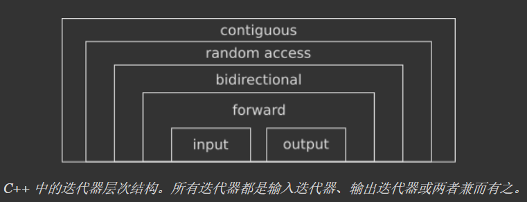

### 自定义迭代器

迭代器是一个指向容器内元素的对象。像指针一样，迭代器可以用来访问它指向的元素，并且可以在容器的内容中移动。C++ 标准库中的每个容器都提供了自己的迭代器，以及一些检索它的方法。使用迭代器非常简单：从容器中获取一个实例，在需要的地方移动它，然后获取指向的元素。

具体来说，迭代器是一个简单的类，它提供了一些运算符重载函数，比如自增、自减、解引用等，这使得它的行为非常类似于指针以及我们通常可以在其上执行算术运算。实际上，迭代器是指针的泛化，在编写迭代器本身时，经常会使用指针作为基础。

迭代器在标准库容器中都有实现，标准库头文件 `<algorithm>` 中提供了一系列基于迭代器的算法接口，只要我们自定义的迭代器遵循规范，就可以向标准库迭代器一样去使用这些算法接口。

#### 迭代器类型

根据功能划分，迭代器总共有如下六种类别：

- 输入迭代器（Input Iterator）：只能向前扫描容器一次，不能改变它指向的值（只读）；
- 输出迭代器（Output Iterator）：只能向前扫描容器一次，不能读取它指向的值（只写）；
- 前向迭代器（Forward Iterator）：可以多次向前扫描容器，可以读写它所指向的值；
- 双向迭代器（Bidirectional Iterator）：与上一个相同，但可以来回扫描容器；
- 随机访问迭代器（Random Access Iterator）：与前一个相同，但也可以非顺序访问容器（即通过跳转）；
- 连续迭代器（Contiguous Iterator）：与前一个相同，除了逻辑上相邻的元素在内存中也是物理上相邻的。

如下图所示，这六个类别是分层的：一个双向迭代器也是一个前向迭代器，一个随机访问迭代器又是一个双向迭代器，以此类推。值得注意的是，在这个层次中，高级迭代器包含低级迭代器中的全部功能，越是低级的迭代器使用起来局限性越大。反过来说，越是高级的迭代器需要实现的功能越复杂。



##### 不同类型的迭代器需要实现的功能

根据规范，不同类别的迭代器需要实现的接口不同，这里对最常用的前向、双向、随机访问迭代器进行介绍：

###### 前向迭代器

假设 p 是一个正向迭代器，则 p 支持以下操作：`++p`，`p++`，`*p`。此外，两个正向迭代器可以互相赋值，还可以用 `==` 和 `!=` 运算符进行比较。

###### 双向迭代器

双向迭代器具有正向迭代器的全部功能。除此之外，若 p 是一个双向迭代器，则 `--p` 和 `p--` 都是有定义的。`--p` 使得 p 朝和 `++p` 相反的方向移动。

###### 随机访问迭代器

随机访问迭代器具有双向迭代器的全部功能。若 p 是一个随机访问迭代器，i 是一个整型变量或常量，则 p 还支持以下操作：

- `p+=i`：使得 p 往后移动 i 个元素。
- `p-=i`：使得 p 往前移动 i 个元素。
- `p+i`：返回 p 后面第 i 个元素的迭代器。
- `p-i`：返回 p 前面第 i 个元素的迭代器。
- `p[i]`：返回 p 后面第 i 个元素的引用。

此外，两个随机访问迭代器 p1、p2 还可以用 `<`、`>`、`<=`、`>=` 运算符进行比较。`p1<p2` 的含义是：p1 经过若干次（至少一次）`++` 操作后，就会等于 p2。其他比较方式的含义与此类似。

对于两个随机访问迭代器 p1、p2，表达式 `p2-p1` 也是有定义的，其返回值是 p2 所指向元素和 p1 所指向元素的序号之差（也可以说是 p2 和 p1 之间的元素个数减一）。

#### 标准库容器中的迭代器类型

下表列出了一些标准库容器中实现的迭代器的类别：

| 容器           | 迭代器类别     |
| -------------- | -------------- |
| vector         | 随机访问迭代器 |
| deque          | 随机访问迭代器 |
| list           | 双向迭代器     |
| set/multiset   | 双向迭代器     |
| map/multimap   | 双向迭代器     |
| stack          | 不支持迭代器   |
| queue          | 不支持迭代器   |
| priority_queue | 不支持迭代器   |


> 在 c++ 中，数组也是容器。数组的迭代器就是指针，而且是随机访问迭代器。例如，对于数组 int a[10]，int * 类型的指针就是其迭代器。则 a、a+1、a+2 都是 a 的迭代器。

#### 类别别名

根据迭代器规范，在所有的迭代器类中，都被要求定义一套如下的类别别名：

- iterator_category：指定迭代器的类别。
- difference_type：一种有符号整数类型，可用于识别迭代器步骤之间的距离。
- value_type：指定迭代器迭代的类型。
- pointer：指针类型，指向被迭代的类型的指针。
- reference：引用类型，被迭代类型的引用。

如下代码展示了一个迭代类型为 int 的迭代器的类型别名定义。

```c++
struct Iterator {
    using iterator_category = std::forward_iterator_tag;
    using difference_type = std::ptrdiff_t;
    using value_type = int;
    using pointer = int*;
    using reference = int&;
    
    // ...
}
```

##### 为什么要定义类型别名?

我们先不直接回答这个问题，而是来尝试解决如下的问题：

定义一个参数中有迭代器的函数模板会产生一个问题，我们并不总是知道在函数模板中要用到哪些类型的迭代器。思考下面用迭代器作为参数的交换函数。其中，模板类型参数指定了迭代器类型。

```c++
template <typename Iter>
void my_swap(Iter a, Iter b) {
    tmp = *a;	//error -- variable tmp undeclared
    *a = *b;
    *b = tmp;
}
```

函数模板的实例用来交换迭代器参数所指向的两个对象：a 和 b。tmp 应该是什么类型我们没法知道，我们知道迭代器指向对象的类型却无计可施，因为直到类模板生成实例时，才能确定对象的类型。在不知道对象的类型时，如何定义变量？当然，这里可以使用 auto。在一些情况下，我们也想知道迭代器类型的值和类型差别。

有些其他的机制可以确定一个迭代器参数所指向值的类型。一种是，坚持要求每个使用 my_swap 函数的迭代器都应该包含一个公共定义的类型别名，因为这样就可以确定迭代器所指向对象的类型。既然这样，就可以在迭代器类中使用 value_type 的别名来指定函数模板 my_swap 函数中 tmp 的类型，如下所示：

```c++
template <typename Iter> void my_swap(Iter a, Iter b) {
    typename Iter::value_type tmp = *a;
    *a = *b;
    *b = tmp;
}
```

因为 value_type 的别名定义在 Iter 类中，所以可以通过用类名限定 value_type 的方式引用它。这样定义了 value_type 别名的迭代器类就能在函数中正常使用。然而，算法既使用指针，也使用迭代器；如果 Iter 是普通类型的指针，例如 `int*`，甚至是 `Box*`，而 Box 是类型一这样可能就无法使用了。因为指针不是类，不能包含定义的别名，所以不能写成 `int*::value_type` 或 `Box*::value_type`。STL 用模板优雅地解决了这个问题和其他一些相关问题！

##### std::iterator_traits

模板类型 iterator_traits 定义在头文件 `<iterator>` 中。这个模板为迭代器的类型特性定义了一套标准的类型别名，让算法既可以用迭代器，也可以用一般的指针。iterator_traits 模板的定义如下所示：

```c++
template<class Iterator>
struct iterator_traits {
    typedef typename Iterator::difference_type difference_type;
    typedef typename Iterator::value_type value_type;
    typedef typename Iterator::pointer pointer;
    typedef typename Iterator::reference reference;
    typedef typename Iterator::iterator_category iterator_category;
}；
```

iterator_traits 模板的主体只包含类型别名的定义。这些别名以 Iterator 作为类型参数的模板。它在模板的类型别名——difference_type、value_type 等，以及用来生成迭代器模板实例的类型，与对应 Iterator 的类型参数之间定义了映射。

因此，对于一个实体类 Boggle，`iterator_traits<Boggle>` 实例定义 difference_type 作为 Boggle::difference_type 的别名，定义 value_type 作为 Boggle::value_type 的别名，等等。

这帮我们有效地解决了不知道模板定义中类型是什么的问题。当以迭代器为参数定义函数模板时，可以在模板中使用 iterator_traits 模板定义的标准类型别名。因此类型 MyIterator 的迭代器代表的指针类型总是可以作为 `std::iterator_traits<MyIterator>::pointer` 引用，因为它等同于 MyIterator::pointer。当需要指定一个 MyIterator 迭代器所指向值的类型时，可以写作 `std::iterator_traits<MyIterator>::value_type`，这将会被映射为 Mylterator::value_ type。我们用 my_swap 函数模板中的 iterator_traits 模板类型别名来指定 tmp 的类型，例如：

```c++
template <typename Iter>
void my_swap(Iter a, Iter b) {
    typename std::iterator_traits<Iter>::value_type tmp = *a;
    *a = *b;
    *b = tmp;
}
```

上述代码将 tmp 的类型指定为 iterator_traits 模板中的 value_type 别名。当用 Iter 模板参数实例化 my_swap 函数模板时，tmp 的类型变为迭代器所指向的类型 Iter::value_type。

为了说清楚发生了什么，以及是如何解决这个问题的，让我们考虑一个 my_swap() 模板实例的具体情况。假设一个程序包含下面的代码：

```c++
std::vector<std::string> words {"one", "two", "three"};
my_swap(std::begin(words), std::begin(words)+1); //Swap first two elements
```

当编译器遇到 my_swap 函数调用时，它会生成一个基于调用参数的函数模板实例。模板类型的迭代器是 `iterator<std::string>`。在 my_swap 函数模板的主体中，编译器不得不处理 tmp 的定义，编译器知道模板的类型参数是 `iterator<std::string>`，因此在向模板添加了这个类型后，tmp 的定义变为：

```c++
typename std::iterator_traits<iterator<std::string> >::value_type tmp = *a;
```

tmp 的类型现在是一个 iterator_traits 模板实例的成员变量。为了弄清楚这意味着什么，编译器需要使用 my_swap 函数中用来指定 tmp 类型的类型参数来实例化 iterator_traits 模板。下面是一个编译器将会生成的 iterator_traits 模板实例：

```c++
struct iterator_traits {
    typedef typename iterator<std::string>::difference_type difference_type;
    typedef typename iterator<std::string>::value_type value_type;
    typedef typename iterator<std::string>::pointer pointer;
    typedef typename iterator<std::string>::reference reference;
    typedef typename iterator<std:: string>:: iterator_category iterator_category;
}；
```

从这里编译器可以确定 tmp 的类型为 `iterator_traits<iterator<std::string>>::value_type`，然而它也是 `iterator<std::string>::value_type` 的别名。就像所有的 STL 迭代器类型，`iterator<std::string>` 类型的定义是从 iterator 模板中生成的，并且会包含 value_type 的定义， 看起来像下面这样：

```c++
typedef std::string value_type;
```

现在编译器从 iterator_traits 实例中知道 `itemtor_traits<itemtor<std::string>>::value_type` 是 `iterator<std::string>::value_type` 的别名，并且从 `itemtor<std::string>` 类定义中知道 `iterator<std::string>:: value_type` 是 std::string 的别名。通过将别名转换为真实类型，编译器推断出 my_swap 函数中 tmp 的定义是：

```c++
std::string tmp = *a;
```

这里仍然遗留了一些有关指针的问题。iterator_traits 如何让算法像接受迭代器一样接受指针。iterator_traits 模板特化了类型 T* 和 const T* 的定义。例如，当模板类型参数是指针类型 T* 时，特化被定义为：

```c++
template<class T>
struct iterator_traits<T*> {
    typedef ptrdiff_t   difference_type;
    typedef T   value_type;
    typedef T*  pointer;
    typedef T&  reference;
    typedef random_access_iterator_tag iterator_category;
}；
```

当模板类型参数是指针类型时，这定义了对应于别名的类型。T* 类型的指针 value_type 的别名总是为 T；如果将 Box* 类型的指针作为 my_swap 函数的参数，那么 value_type 的别名是 Box，因此 tmp 也为这种类型。

随机访问迭代器类别所要求的全部操作都可以运用到指针上。因此对于指针，iterator_categor 的别名总是等同于 std::random_access_iterator_tag 类型。因而 iterators_traits 能否正常工作取决于模板类型参数是指针还是迭代器类类型。当模板类型参数是指针时，会选择使用 iterators_traits 针对指针的特例化模板；否则选择标准的模板定义。

##### iterator_category

上述内容主要说明了 value_type、pointer、reference 的作用，实际上，iterator_category 也很重要。如果我们使用头文件 `<algorithm>` 中的算法函数，那么这些函数将根据迭代器类别（iterator_category）来选择最高效的算法，错误的标签意味着次优的性能。除此之外，某些算法对迭代器类别有硬性要求，例如：`std::fill` 需要一个前向迭代器，而 `std::reverse` 需要一个双向迭代器，传递错误的迭代器将导致编译错误。

标准库头文件 `<iterator>` 包含了迭代器类型的定义（注意它们都是结构体）：

```c++
std::input_iterator_tag;
std::output_iterator_tag;
std::forward_iterator_tag;
std::bidirectional_iterator_tag;
std::random_access_iterator_tag;
```

##### difference_type

最后再提一下 difference_type ，它用来指定两个迭代器之间差值的类型，通常被设置为 std::ptrdiff_t ，它被包含在头文件 `<cstddef>` 中。

#### 实现一个简单的前向迭代器

如下代码定义了一个简单的容器（内部是一个固定长度的数组），并在容器类的内部定义了一个前向迭代器。

```c++
/**
 * @brief 简单的自定义容器，内部主要实现了迭代器的逻辑
 */
class Integers {

public:
    /**
     * @brief 容器的迭代器通常定义为内部类
     */
    struct Iterator {
        
        // 类型别名
        using iterator_category = std::forward_iterator_tag;
        using difference_type = std::ptrdiff_t;
        using value_type = int;
        using pointer = int*;
        using reference = int&;
        
        // 构造函数
        Iterator(pointer ptr) : m_ptr(ptr) {
        
        }

        // 重载解引用运算符
        reference operator*() const {
            return *m_ptr;
        }
        
        // 重载箭头运算符
        pointer operator->() {
            return m_ptr;
        }
        
        // 重载前缀自加运算符
        Iterator& operator++() {
            m_ptr++;
            return *this;
        }
        
        // 重载后缀自加运算符
        Iterator operator++(int) {
            Iterator tmp = *this;
            ++(*this);
            return tmp;
        }
        
        // 重载相等关系运算符
        friend bool operator==(const Iterator& left, const Iterator& right) {
            return left.m_ptr == right.m_ptr;
        }
        
        // 重载不等关系运算符
        friend bool operator!=(const Iterator& left, const Iterator& right) {
            return left.m_ptr != right.m_ptr;
        }
        
    private:
        pointer m_ptr;
    };

public:
    // 构造一个指向第一个元素的迭代器对象
    Iterator begin() {
        return Iterator(&m_data[0]);
    }
    
    // 构造一个指向最后一个元素的迭代器对象
    Iterator end() {
        return Iterator(&m_data[200]);
    }

private:
    // 容器本质上是一个数组
    int m_data[200];
};
```

如下测试代码展示了使用 `std::fill` 函数初始化容器中的数据。

```c++
#include <iostream>     // for std::cout
#include <algorithm>    // for std::fill

#include "Integers.h"   // for Integers

int main(int argc, char** argv) {
    
    Integers integers;
    std::fill(integers.begin(), integers.end(), 3);
    for (const auto &item : integers) {
        std::cout << item << std::endl;
    }

    return 0;
}
```


#### 参考

[Writing a custom iterator in modern C++](https://www.internalpointers.com/post/writing-custom-iterators-modern-cpp)

[C语言中文网：C++自定义迭代器（STL自定义迭代器)的实现详解](http://c.biancheng.net/view/471.html)